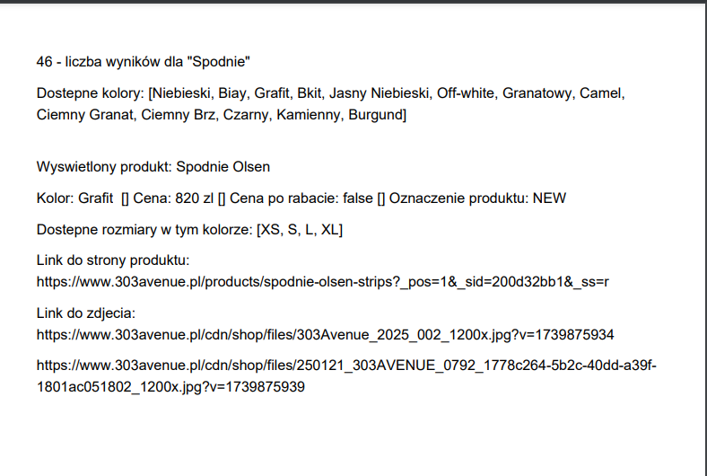
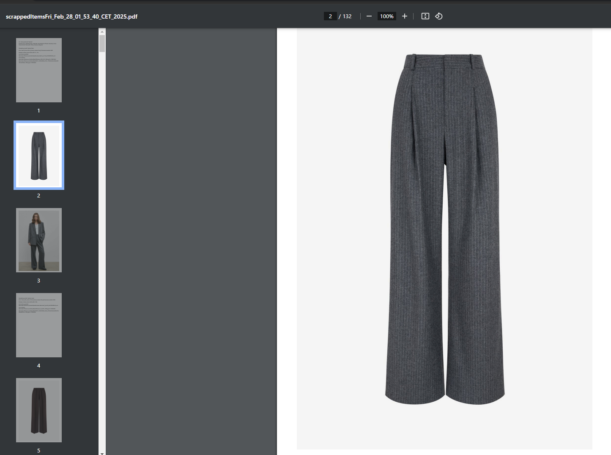
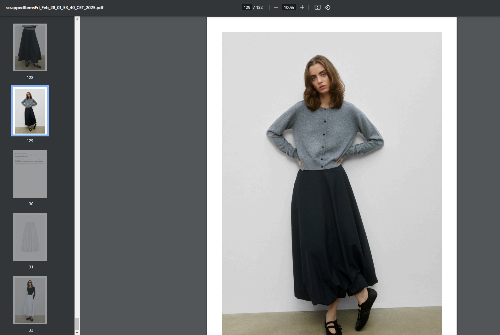
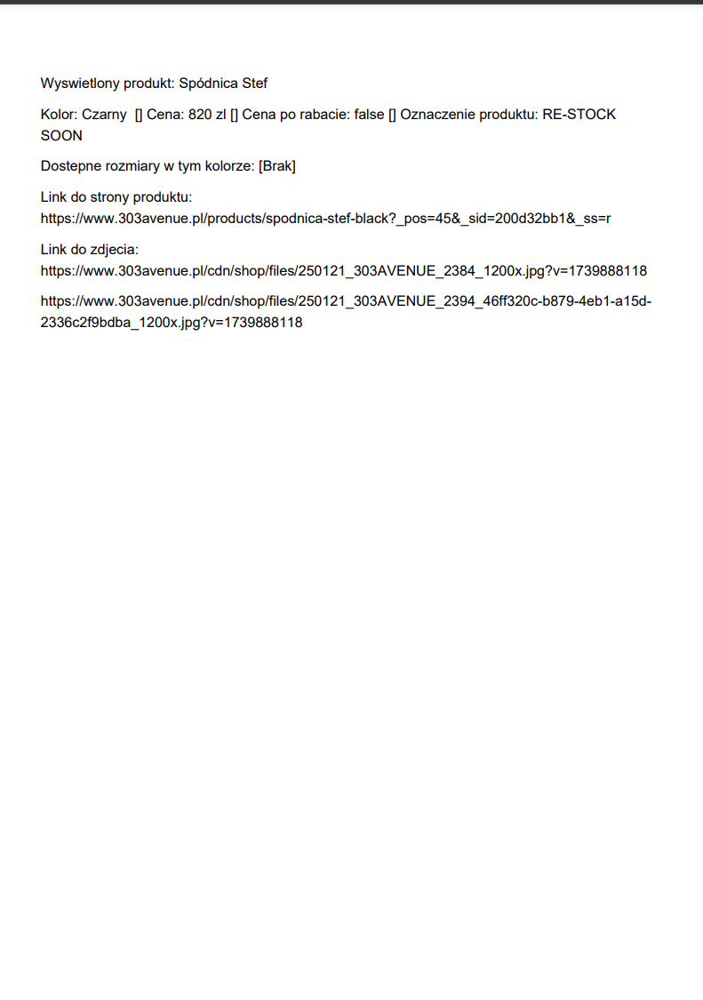
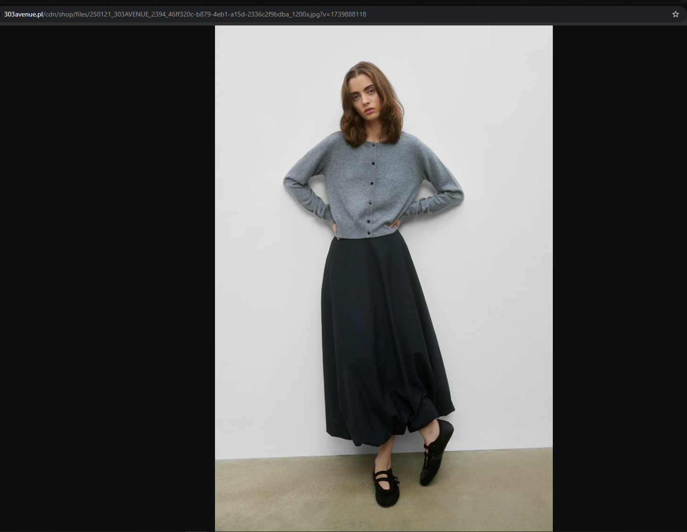
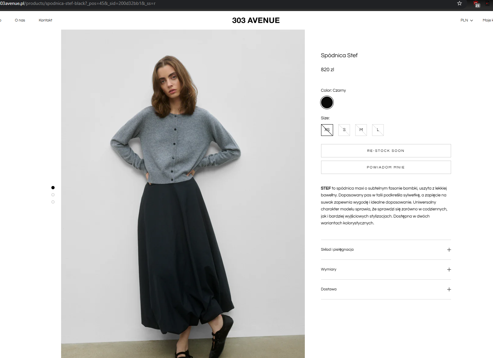

#  *** *Website Scrapper Project* ***

### Description:
> For practise and gathering skill I decided to create script which collect 
> specyfic type of products from "Search" functionality. :fire:

### Tools, Frameworks, Design patterns and Methodologies: :shipit:
> * Java programming language
> * Maven
> * Selenium
> * TestNG
> * Itextpdf
> * POM model

What script does?
- counts products in general
- shows all available colours 
- each product has his special details: colour, price, discount if available, product tag, available sizes
- each product has hyperlink which provides to the main page, hyperlink for webphotos
- below product details adds product photos if available

In conclusion we can click on hyperlink to see product or scroll down to the next page to see product images

** When you search "Spodnie" you will gather also different kind of products that`s why I have dress in PDF.
This is how "search" works on this webpage.

> * That`s first page from PDF document:

> * Next pages:

> * One product sample - Spodnica Stef

> * After click hyperlink product image:

> * After click hyperlink product website:

